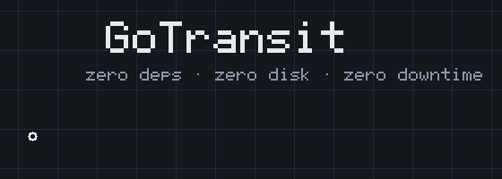

<p align="center">
  
</p>

<p align="center">
  
  
  
  
  
</p>

<h3 align="center">A featherweight, runtime-updating, never-leaves-you-alone<br>public transport routing engine in pure Go.</h3>

---

```bash
gotransit init   # writes a commented gotransit.toml
gotransit        # that's it. forever.
```

Open `http://localhost:8080/`, click twice on the map, watch the bus come to
you in realtime. 🚌

## 🧭 What is this

OTP-class engines hold multi-GB object graphs, boot in minutes, want a rebuild
for every data change, and hide behind dozens of knobs in multiple config
files. GoTransit is the opposite bet, taken seriously:

| | OTP-style | GoTransit *(centro Italia + Roma + COTRAL + Trenitalia, measured)* |
|---|---|---|
| 🧠 RAM | 4–8 GB | **~450 MB** (engine data + in-RAM sources) |
| 💾 Disk | GBs | **zero bytes** — download → parse → destroy → poll |
| ⚡ Boot | minutes | **~25 s** after download |
| 🔁 Data updates | rebuild + restart | **live, atomic, zero downtime** |
| ⚙️ Config | ~50 knobs, 3 files | **1 TOML**, two required lines |
| 📦 Deps | JVM + ecosystem | **Go stdlib only**, single static binary |

## 🚀 The engine

- **🗺️ Street graph from OSM** — hand-written parallel PBF decoder (380 MB in
  ~2 s), compiled once into flat CSR arrays: int32 nodes, packed flags,
  delta-varint geometry. Queries never chase a pointer.
- **🚏 RAPTOR for transit** — flat pattern/trip arrays, two service-day layers
  (a `25:30` night run boards correctly at 01:30), stop-to-stop transfers
  precomputed on the *street network*, not beelines.
- **🚴 Weighted A\* for streets** — walk, bike, car, with turn-by-turn street
  names. Deliberately **no contraction hierarchies**: preprocessing would die
  on every live OSM diff. Plain A\* on live arrays does Roma→Firenze (275 km,
  68 instructions) in ~30 ms core.
- **🚲+🚌 bike+transit that behaves** — bike legs only when they beat the
  walking plan by ≥5 min (configurable), capped at 18 min, with the honest
  "just ride the whole way" comparison included. No 1-hour bike legs, ever.
- **🕐 Timezone-proof** — every query and answer speaks the network's GTFS
  timezone, whatever the client or host think their clock is.
- **🛂 Coverage guard** — trips whose shapes/stops leave the imported extract
  are excluded *categorically* and reported loudly (Trenitalia's national
  network vs a centro-Italia extract: 18 800 trips on 2 601 routes cut, all
  accounted for at startup and in `/v1/status`).
- **🔄 Zero-downtime everything** — GTFS re-polled every minute via ETag; OSM
  updated through Geofabrik osmChange diffs applied to an in-RAM compressed
  source (no PBF re-download, no disk); every refresh builds an immutable
  snapshot and swaps a pointer. In-flight queries never notice.

## 📡 Live: the engine that never leaves you alone

Wire the GTFS-RT endpoints (`rt_trip_updates` / `rt_vehicle_positions` — ATAC,
COTRAL and Trenitalia examples ship in `gotransit init`) and:

- every plan is **RT-adjusted by construction** — RAPTOR reads times through
  an immutable realtime overlay (per-stop delay propagation, cancellations,
  skipped stops, vehicle positions), swapped atomically on every poll;
- `&live=1` returns **live itineraries**: the first bus is *certain*
  (RT-confirmed, departing ≤45 min) and everything in the next hour is
  covered. **Metro counts as live by definition** — frequent, always running,
  it just doesn't emit VP/TU entities;
- `GET /v1/track?itinerary=<id>` upgrades to a **WebSocket** (RFC 6455,
  hand-rolled, of course) and the engine walks with the user — **no GPS
  needed**. It trusts the feeds: if GTFS-RT says your bus passed your stop,
  you're on board.

Sequential, client-friendly events:

| event | what you get |
|---|---|
| `hello` | the tracked itinerary, `live` or `monitor` mode |
| `vehicle` | 🚌 where your bus **is** — position, the stop it's approaching, `stops_away` from you, its delay — even while you're still walking |
| `delay` | refreshed per-leg times whenever anything moves ≥30 s |
| `progress` | boarding confirmed / alighted |
| `warning` | `no_rt_signal`, `possibly_cancelled` (inferred *before* the operator's late CANCELED shows up) |
| `reroute` | a full replacement itinerary + `changed_legs` + reason: `better_arrival` (≥5 min gained, never flip-flops), `cancelled`, `missed_connection` (yes, also the bus that came *early*), `stop_skipped` |
| `arrived` | 🎉 |

**A broken plan is always replaced.** Missed connection, cancellation,
skipped stop → replan from the user's virtual position (on board, it seeds
*every downstream stop* with its RT arrival: hop off early, stay on longer,
switch lines — whatever arrives first wins), in live *and* monitor mode,
retrying until an alternative exists. The whole loop is covered by a
wall-clock E2E test driving a fake evolving RT feed through
delay → better-arrival reroute → cancellation reroute → vehicle-confirmed
boarding → early arrival.

## 📊 Measured (Apple M-series, 8 GB)

| Query | Time |
|---|---|
| Transit, urban (Termini → EUR) | **~20 ms** (RAPTOR core 5.7 ms) |
| Transit, multi-operator (Roma → Tivoli) | 26 ms |
| bike+transit with variants | 66 ms |
| Arrive-by (latest departure) | ~130 ms |
| Walk, turn-by-turn | 5 ms |
| Car Roma → Firenze, 275 km | ~60 ms |
| GTFS change → new timetable live | ~4 s background |
| OSM daily diff → new street graph live | ~5 s background, no PBF, no disk |

Live matching observed on production feeds: ATAC **1055/1055** trips,
COTRAL 485/521, Trenitalia 260 in-extract (+7 CANCELED caught at test time),
real delays from +34 s to +16 min flowing straight into itineraries.

## 🔌 API

Plain JSON over GET — React Native `fetch`, curl, whatever. CORS open.

```
GET /v1/plan?from=41.9009,12.5013&to=41.8385,12.4675
             &mode=transit          transit | bike_transit | bike | car | walk
             &depart=now            RFC3339, "YYYY-MM-DD HH:MM" (network tz), or arrive=…
             &live=1&num=3
GET /v1/track?itinerary=<id>        WebSocket journey tracking
GET /v1/status                      data versions, RT health, exclusions
GET /v1/health
GET /                               🗺️ map debug UI (debug_ui = false to disable)
```

Every leg carries encoded polylines, per-stop times with codes, distances,
`realtime` + `delay_s`, and turn-by-turn steps with real street names
("turn right onto Via Cesare Battisti").

## ⚙️ Config (the whole thing)

```toml
listen = ":8080"

[osm]
url  = "https://download.geofabrik.de/europe/italy/centro-latest.osm.pbf"
# Geofabrik = live osmChange updates. Local paths work too, never deleted.

[[gtfs]]
name = "roma"
url  = "https://romamobilita.it/sites/default/files/rome_static_gtfs.zip"
rt_trip_updates      = "https://romamobilita.it/sites/default/files/rome_rtgtfs_trip_updates_feed.pb"
rt_vehicle_positions = "https://romamobilita.it/sites/default/files/rome_rtgtfs_vehicle_positions_feed.pb"
```

Everything else has defaults — polling (GTFS every minute via ETag), speeds,
transfer slack, live thresholds, reroute hysteresis. `gotransit init` writes
them all, commented.

## 🧪 Tests

```bash
go test ./...                       # unit + synthetic + wall-clock E2E
GOTRANSIT_TEST_DATA=~/captures \
  go test ./tests/ -run TestReal    # full pipeline on real OSM/GTFS captures
```

The suite lives in [`tests/`](tests/) — black-box, against exported APIs
only. CI runs everything, race detector on, for every push to `main` and
every PR.

## 🏗️ How it works

One page: [ARCHITECTURE.md](ARCHITECTURE.md). Spoiler: flat arrays, atomic
pointer swaps, immutable snapshots, and a stubborn refusal to keep anything
on disk or import anything at all.

## 🤝 Contributing

PRs welcome — see [CONTRIBUTING.md](CONTRIBUTING.md). House rules in short:
stdlib only, measure before and after, and updates must never block a query.

## 📄 License

[MIT](LICENSE). Route responsibly. 🚋
