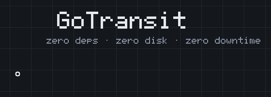

<p align="center">
  
</p>

<p align="center">
  
  
  
  
  
</p>

<h3 align="center">A featherweight, runtime-updating, never-leaves-you-alone<br>public transport routing engine in pure Go.</h3>

---

```bash
gotransit init   # writes a commented gotransit.toml
gotransit        # that's it. forever.
```

Open `http://localhost:8080/`, click twice on the map, watch the bus come to
you in realtime. 🚌

## 🧭 What is this

OTP-class engines hold multi-GB object graphs, boot in minutes, want a rebuild
for every data change, and hide behind dozens of knobs in multiple config
files. GoTransit is the opposite bet, taken seriously:

| | OTP-style | GoTransit *(centro Italia + Roma + COTRAL + Trenitalia, measured)* |
|---|---|---|
| 🧠 RAM | 4–8 GB | **scales from live flat data**, with automatic GC/cache budgets |
| 💾 Disk | GBs | **zero by default**; optional compact source cache replaces the larger PBF |
| ⚡ Boot | minutes | **~25 s** after download |
| 🔁 Data updates | rebuild + restart | **live, atomic, zero downtime** |
| ⚙️ Config | ~50 knobs, 3 files | **1 TOML**, two required lines |
| 📦 Deps | JVM + ecosystem | **Go stdlib only**, single static binary |

## 🚀 The engine

- **🗺️ Street graph from OSM** — hand-written parallel PBF decoder (380 MB in
  ~2 s), compiled once into flat CSR arrays: int32 nodes, packed flags,
  delta-varint geometry. Queries never chase a pointer.
- **🚏 RAPTOR for transit** — flat pattern/trip arrays, two service-day layers
  (a `25:30` night run boards correctly at 01:30), stop-to-stop transfers
  precomputed on the *street network*, not beelines.
- **🚴 Weighted A\* for streets** — walk, bike, car, with turn-by-turn street
  names. Deliberately **no contraction hierarchies**: preprocessing would die
  on every live OSM diff. Plain A\* on live arrays does Roma→Firenze (275 km,
  68 instructions) in ~30 ms core.
- **🚲+🚌 GBFS-aware bike+transit** — with `[[gbfs]]`, a bike leg means a real
  currently rentable bike: walk to it, unlock, ride, return where legal, walk
  on. Station pools, dockless vehicles, e-bikes and scooters stay distinct;
  battery range, return capacity and geofences are checked before routing.
  `personal_bike_transit` keeps explicit bring-your-own-bike behavior;
  `bike_transit` falls back to that legacy behavior only when no GBFS source
  is configured.
- **🕐 Timezone-proof** — every query and answer speaks the network's GTFS
  timezone, whatever the client or host think their clock is.
- **🛂 Coverage guard** — trips whose shapes/stops leave the imported extract
  are excluded *categorically* and reported loudly (Trenitalia's national
  network vs a centro-Italia extract: 18 800 trips on 2 601 routes cut, all
  accounted for at startup and in `/v1/status`).
- **🔄 Zero-downtime everything** — GTFS re-polled every minute via ETag; OSM
  updated through Geofabrik osmChange diffs applied to a compact source image
  (file-backed when `[cache]` exists, in RAM otherwise); every refresh builds an immutable
  snapshot and swaps a pointer. In-flight queries never notice.

## 📡 Live: the engine that never leaves you alone

Wire the GTFS-RT endpoints (`rt_trip_updates` / `rt_vehicle_positions` — ATAC,
COTRAL and Trenitalia examples ship in `gotransit init`) and:

- every plan is **RT-adjusted by construction** — RAPTOR reads times through
  an immutable realtime overlay (per-stop delay propagation, cancellations,
  skipped stops, vehicle positions), swapped atomically on every poll;
- `&live=1` returns **live itineraries**: the first road vehicle is
  RT-confirmed and departs ≤45 min out, while rail-like services remain
  trackable from their timetable and any available TripUpdates even when the
  operator publishes no VehiclePosition;
- `GET /v1/track?itinerary=<id>` upgrades to a **WebSocket** (RFC 6455,
  hand-rolled, of course). GPS is optional: with it, the tracker latches a
  reached boarding stop and can confirm an early pickup from ordered movement
  along the ride shape; without it, the clock and realtime feeds govern.

Sequential, client-friendly events:

| event | what you get |
|---|---|
| `hello` | the tracked itinerary, `live` or `monitor` mode (`protocol: 3`) |
| `vehicle` | 🚌 where your bus **is** — position, the stop it's approaching, `stops_away` from you, its delay — even while you're still walking |
| `delay` | refreshed per-leg times whenever anything moves ≥30 s |
| `progress` | boarding confirmed / alighted; rail fallback adds `tracking_source: "schedule_assumed"` |
| `warning` | `no_rt_signal`, `possibly_cancelled`, `shared_vehicle_unavailable`, or one-shot `position_unavailable` before schedule-assumed rail tracking |
| `reroute` | a full replacement itinerary + `changed_legs` + reason: `better_arrival`, `cancelled`, `missed_connection`, `stop_skipped`, `shared_vehicle_unavailable` |
| `arrived` | 🎉 |

**A broken plan is always replaced.** Missed connection, cancellation,
skipped stop → replan from the user's virtual position (on board, it seeds
*every downstream stop* with its RT arrival: hop off early, stay on longer,
switch lines — whatever arrives first wins), in live *and* monitor mode,
retrying until an alternative exists. The whole loop is covered by a
wall-clock E2E test driving a fake evolving RT feed through
delay → better-arrival reroute → cancellation reroute → vehicle-confirmed
boarding → early arrival.

The same loop watches every future GBFS rental while the user walks, waits or
rides transit. If the assigned vehicle is taken, its station empties, its
battery falls below the routed distance plus reserve, the return dock fills,
or the feed goes stale, GoTransit replans the **whole** remaining journey. From
an occupied bus it seeds every safe downstream stop, so getting off earlier or
later, using another shared vehicle, changing service, staying on, and going
transit-only all compete by expected arrival. A slower replacement bike never
wins merely because the original itinerary contained a bike.

## 📊 Measured (Apple M-series, 8 GB)

| Query | Time |
|---|---|
| Transit, urban (Termini → EUR) | **~20 ms** (RAPTOR core 5.7 ms) |
| Transit, multi-operator (Roma → Tivoli) | 26 ms |
| bike+transit with variants | 66 ms |
| Arrive-by (latest departure) | ~130 ms |
| Walk, turn-by-turn | 5 ms |
| Car Roma → Firenze, 275 km | ~60 ms |
| GTFS change → new timetable live | ~4 s background |
| OSM daily diff → new street graph live | ~5 s background, no PBF re-download |

Live matching observed on production feeds: ATAC **1055/1055** trips,
COTRAL 485/521, Trenitalia 260 in-extract (+7 CANCELED caught at test time),
real delays from +34 s to +16 min flowing straight into itineraries.

## 🔌 API

Plain JSON over GET — React Native `fetch`, curl, whatever. CORS open.

```
GET /v1/plan?from=41.9009,12.5013&to=41.8385,12.4675
             &mode=transit          transit | bike_transit | scooter_transit |
                                    shared_transit | personal_bike_transit |
                                    bike | car | walk
             &vehicle=bicycle       bicycle | scooter | any (shared modes)
             &depart=now            RFC3339, "YYYY-MM-DD HH:MM" (network tz), or arrive=…
             &live=1&num=3
GET /v1/track?itinerary=<id>        WebSocket journey tracking
GET /v1/status                      data versions, RT health, exclusions
GET /v1/health
GET /                               🗺️ map debug UI (debug_ui = false to disable)
```

Every leg carries encoded polylines, per-stop times with codes, distances,
`realtime` + `delay_s`, and turn-by-turn steps with real street names
("turn right onto Via Cesare Battisti").

## ⚙️ Config (the whole thing)

```toml
listen = ":8080"

# Optional: keeps remote GTFS ZIPs and the compact OSM update image off-heap.
# [cache]
# dir = "/var/cache/gotransit"

[osm]
url  = "https://download.geofabrik.de/europe/italy/centro-latest.osm.pbf"
# Geofabrik = live osmChange updates. Local paths work too, never deleted.

[[gtfs]]
name = "roma"
url  = "https://romamobilita.it/sites/default/files/rome_static_gtfs.zip"
rt_trip_updates      = "https://romamobilita.it/sites/default/files/rome_rtgtfs_trip_updates_feed.pb"
rt_vehicle_positions = "https://romamobilita.it/sites/default/files/rome_rtgtfs_vehicle_positions_feed.pb"

[[gbfs]]
name = "city-bikes"
url  = "https://operator.example/gbfs.json"
poll = "20s"
max_age = "5m"
```

Everything else has defaults — polling (GTFS every minute via ETag), speeds,
transfer slack, live thresholds, reroute hysteresis. `gotransit init` writes
them all, commented.

### GBFS behavior

GoTransit consumes [GBFS](https://github.com/MobilityData/gbfs) auto-discovery
across 1.x, 2.x and 3.x, including
`station_information`, `station_status`, `free_bike_status`/`vehicle_status`,
`vehicle_types` and `geofencing_zones`. Sparse legacy feeds default to a human
bicycle as required by GBFS; richer feeds retain form factor and propulsion.
Motorized vehicles are only promised when a per-vehicle
`current_range_meters` is available (or can be derived from a reported battery
percentage and `max_range_meters`). Aggregate e-bike counts without battery
data are deliberately not guessed.

Each rental leg includes a `rental` object with provider, vehicle/type or
station-pool identifiers, pickup/return coordinates, rental deep links,
propulsion, battery/range, return constraint and routed required range. Status
and freshness are visible under `shared_mobility` in `/v1/status`.

## 🧪 Tests

```bash
go test ./...                       # unit + synthetic + wall-clock E2E
GOTRANSIT_TEST_DATA=~/captures \
  go test ./tests/ -run TestReal    # full pipeline on real OSM/GTFS captures
```

The suite lives in [`tests/`](tests/) — black-box, against exported APIs
only. CI runs everything, race detector on, for every push to `main` and
every PR.

## 🏗️ How it works

One page: [ARCHITECTURE.md](ARCHITECTURE.md). Spoiler: flat arrays, atomic
pointer swaps, immutable snapshots, adaptive memory control, and zero runtime
dependencies.

## 🤝 Contributing

PRs welcome — see [CONTRIBUTING.md](CONTRIBUTING.md). House rules in short:
stdlib only, measure before and after, and updates must never block a query.

## 📄 License

[MIT](LICENSE). Route responsibly. 🚋
